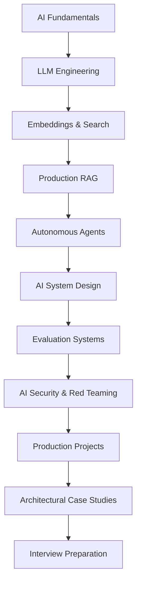

## System Topology

The curriculum moves from first principles into deployable architecture. Each layer introduces constraints that later modules depend on: model fundamentals shape prompt design, prompt design shapes orchestration, orchestration shapes evaluation, and evaluation shapes security and rollout strategy.

## Curriculum Backbone

The first module establishes how models represent information, consume compute, and behave under uncertainty. The middle modules translate those foundations into practical systems: structured outputs, tools, memory, retrieval, routing, tracing, and production evaluation. The final modules focus on security, reference projects, real-world architectures, and interview-grade system design fluency.

## Delivery Matrix

Every topic follows the same three-page structure:

- Overview: the conceptual boundary, vocabulary, and engineering purpose.
- System Architecture: components, data flow, constraints, and failure surfaces.
- Technical Deep Dive: implementation details, performance mechanics, and production tradeoffs.

## Implementation Track

Python examples live outside the content tree so they remain source code, not embedded documentation fragments. Each implementation should be small enough to inspect, realistic enough to reuse, and documented enough to explain the system concept it represents.

## Completion Target

The foundation is designed so future writing can happen without sidebar, routing, or build-configuration churn. New content should only need to fill the existing overview, architecture, and deep-dive pages for a topic.
