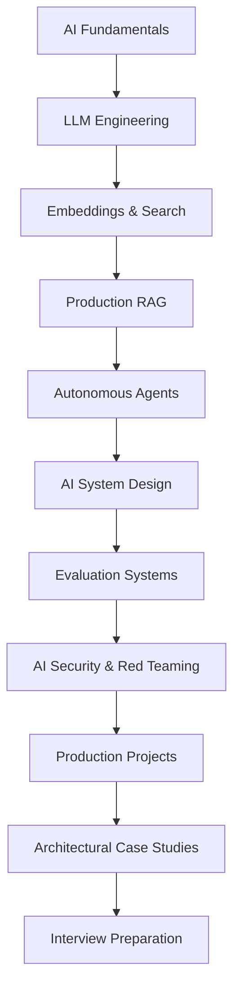

## System Topology

The curriculum moves from first principles into deployable architecture. Each layer introduces constraints that later modules depend on: model fundamentals shape prompt design, prompt design shapes orchestration, orchestration shapes evaluation, and evaluation shapes security and rollout strategy.

## Curriculum Backbone

The first module establishes how models represent information, consume compute, and behave under uncertainty. The middle modules translate those foundations into practical systems: structured outputs, tools, memory, retrieval, routing, tracing, and production evaluation. The final modules focus on security, reference projects, real-world architectures, and interview-grade system design fluency.

## Delivery Matrix

Every topic follows the same three-page structure:

- `01-overview.md`: the conceptual boundary, vocabulary, and engineering purpose.
- `02-architecture.md`: components, data flow, constraints, and failure surfaces.
- `03-deep-dive.md`: implementation details, performance mechanics, and production tradeoffs.

## Publishing Rule

The full folder matrix exists in the repository, but placeholder-only topics stay hidden from the public sidebar. When a page moves beyond scaffold text, the sidebar reveals that page automatically on the next build.

## Writing Rule

The foundation is designed so future writing can happen without sidebar, routing, or build-configuration churn. New content should only need to fill the existing overview, architecture, and deep-dive pages for a topic.
