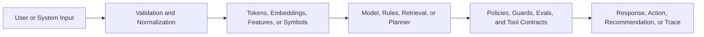

## Paradigm Map

AI systems can be built from symbolic reasoning, statistical learning, or hybrids of both. The right architecture depends on whether the task is best solved by explicit rules, learned patterns, retrieval over knowledge, or generated sequences.

## Symbolic Systems

Symbolic AI represents knowledge as rules, graphs, constraints, programs, or formal logic. These systems are valuable when correctness depends on explicit business policy, deterministic reasoning, explainable state transitions, or verifiable constraints.

Symbolic systems are predictable, inspectable, and easy to audit. Their weakness is brittleness: every edge case must be modeled manually, and the system does not automatically generalize from examples unless engineers build that adaptation path.

## Statistical Systems

Statistical AI learns behavior from data. A model is trained to approximate a mapping from input representations to desired outputs by optimizing an objective function. This allows generalization across examples that were never explicitly encoded as rules.

Statistical systems are powerful when data is abundant, patterns are fuzzy, and manually encoding rules would be unrealistic. Their weakness is uncertainty: outputs have to be evaluated empirically, and model behavior can drift when data, prompts, traffic, or user intent changes.

## Representation Learning

Deep learning pushes statistical systems further by learning intermediate representations automatically. Instead of hand-designing every feature, neural networks learn layered transformations that turn raw inputs into useful internal structures.

Transformers extended this pattern to sequence modeling at scale. Tokens are mapped into vectors, attention layers mix contextual information, and output distributions are decoded into text, tool calls, classifications, or other structured results.

## Hybrid Production Architecture

Modern AI products often combine paradigms:

- Symbolic policies decide what a model is allowed to do.
- Statistical models interpret language, classify intent, rank options, or generate responses.
- Retrieval systems provide external context so outputs can be grounded.
- Tool execution layers expose deterministic operations such as database reads or workflow actions.
- Evaluation and monitoring systems measure model behavior after release.

## System Topology

## Architecture Takeaway

The core architectural decision is not "rules or models." It is which responsibilities should be deterministic, which should be learned, which should be retrieved, and which should be monitored continuously.
